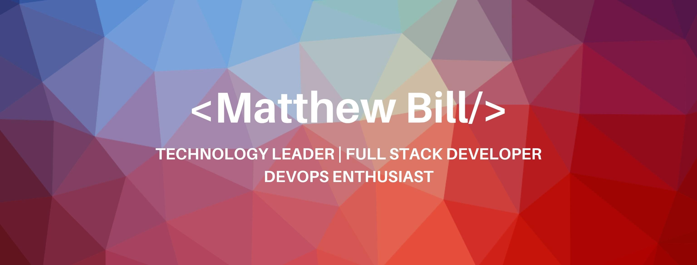

# Hey  , I'm Matt!

## About Me

I have been working in the tech industry for 15 years with a background in Software Engineering as a full stack developer working with Node.js, React and .Net along with various different data stores and messaging systems. I have designed and built large scale and big data solutions within AWS and GCP, as well as had experience leading DevOps and Data Science initiatives. I also happen to be certified in [Agile Coaching](https://www.icagile.com/credentials/f3bcae30-aaa1-4000-bcfe-f5881ae36015) and [Scrum Mastery](https://www.scrumalliance.org/community/profile/mbill2).

- 🌱 I’m currently learning all about web3, privacy orientated and distributed technologies.
- 💞️ I’m looking to collaborate on open source projects.
- 📫 You can get in touch with me through [LinkedIn](https://www.linkedin.com/in/matthewbill/).
- 📖 I enjoy writing articles on [Medium](https://medium.com/@matthewdbill) and speaking at events.
- 🎲 Fun Fact: I have been running D&D games for nearly 20 years now!

Web3 Domain ([Unstoppable](https://unstoppabledomains.com/)): [matthewbill.crypto](matthewbill.crypto)
